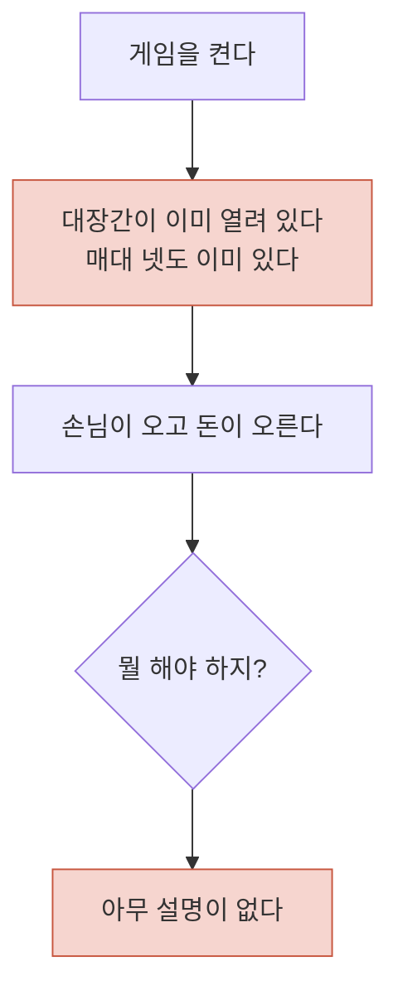
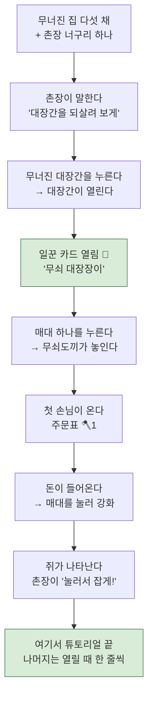
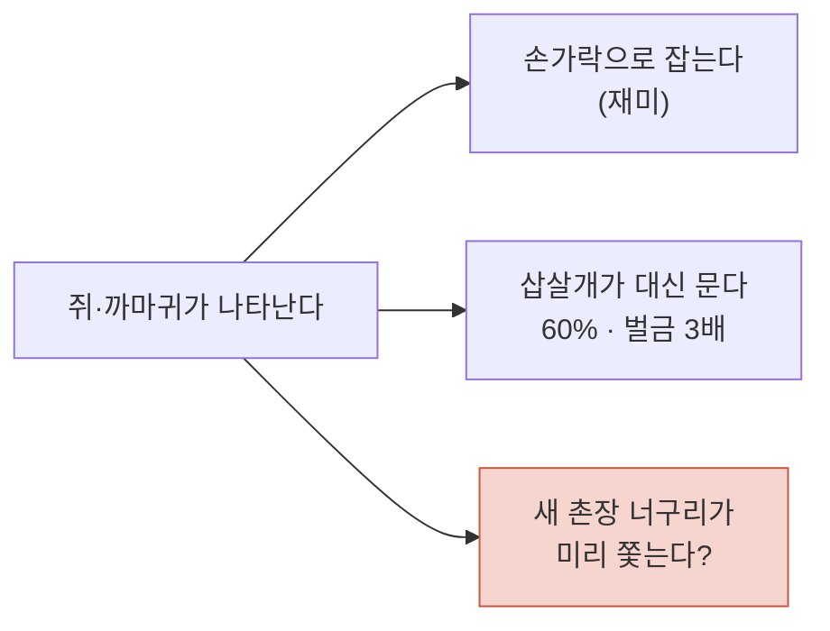
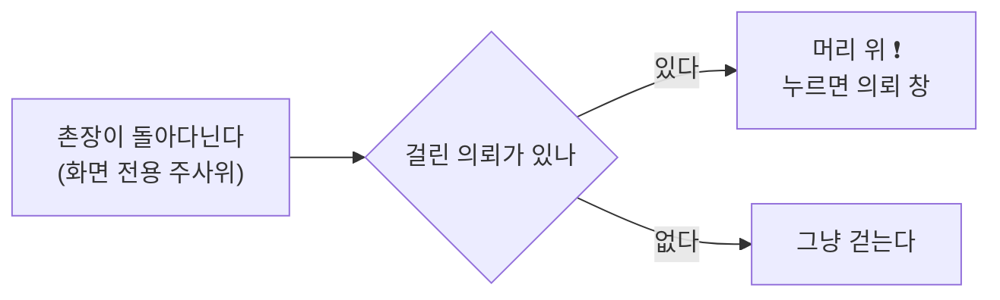
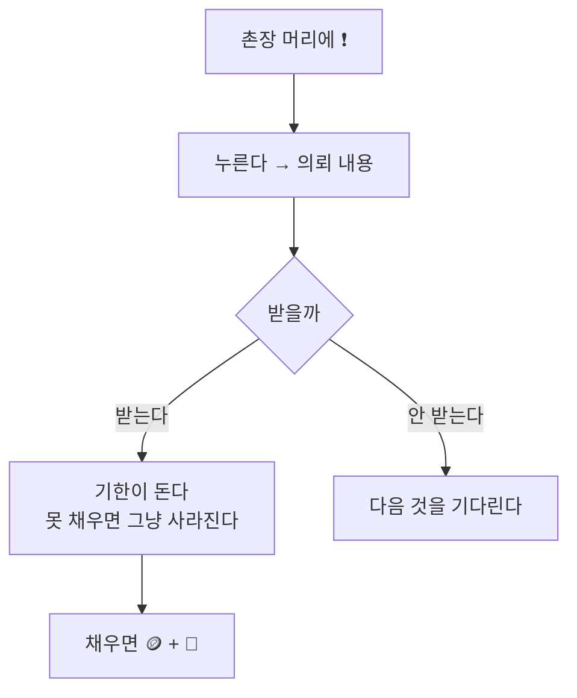
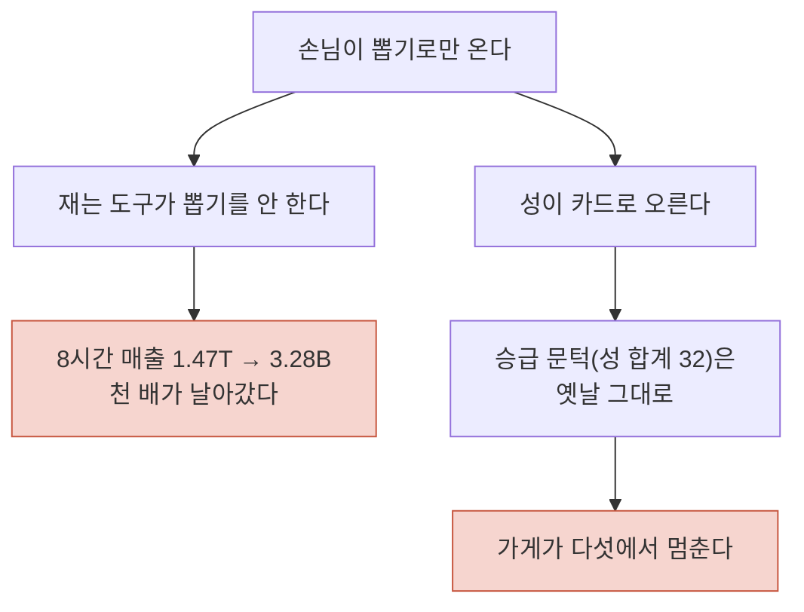
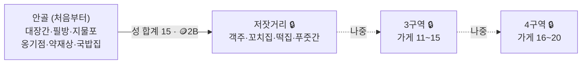

# 흐름과 꼬인 곳

**이 문서는 코드가 아니라 그림이다.** 무엇이 무엇과 이어지는지, 그리고
**어디가 끊겼는지**를 본다. 기능을 더 넣기 전에 여기부터 맞춘다.

만드는 사람이 물었다 — *"이것저것 막 넣다 보니 꼬이는 부분이 보이면 알려줘."*
아래가 지금 눈에 보이는 것들이다. 하나씩, 왜 꼬였는지와 함께.

---

## 1. 지금 처음 켜면 벌어지는 일

**끊긴 곳:** 시작이 없다. 대장간은 `sim.shops = ["smith"]`로 **처음부터 켜져
있고**, 그래서 "가게를 연다"라는 이 게임의 첫 동작을 아무도 해 보지 않는다.
제일 좋은 첫 순간을 코드가 미리 써 버린 셈이다.

## 2. 제안 — 처음 3분

**규칙 하나:** 한 번에 하나씩만 연다. 지금 이 게임에는 **열두 가지**가 있다 —
매대 강화 · 칸 열기 · 가게 열기 · 승급 · 일꾼 · 젬 강화 · 의뢰 · 기간제 이벤트 ·
장 서기 · 나쁜 놈 · 삽살개 · 작은 건물. 처음 3분에 이걸 다 보여주면 아무도 안 남는다.

## 3. 나쁜 놈 — 셋이 같은 일을 한다 ⚠️

**꼬인 곳:** 손가락으로 잡는 것이 이 게임에서 몇 안 되는 **진짜 조작**인데,
자동으로 처리해 주는 장치가 이미 하나(삽살개) 있고 여기에 촌장까지 더하면
**둘이 된다.** 자동이 둘이면 손가락이 할 일이 사라진다.

- 지금 삽살개는 *"자리를 비운 사이 대신 잡는다"*고 적혀 있는데,
  **코드는 온라인·오프라인을 안 가린다.** 설명이 코드보다 좁게 적혀 있었다.
  (만드는 사람이 "오프라인에만 있는 건 안 될 듯"이라 한 것 —
  실제로는 이미 늘 일한다. **고칠 것은 코드가 아니라 문구와 그림**이다.)
- 촌장에게 주려면 **다른 일**을 줘야 한다. 잡는 것 말고:
  - 나쁜 놈이 **나타나기 전에 알려준다**(느낌표를 띄운다) — 잡는 재미는 그대로 두고
    "놓쳤다"만 줄인다
  - 길에 떨어진 것을 줍는다(순전한 눈요기)
  - 손님을 마중한다

## 4. 너구리가 셋이 된다 ⚠️

| 누구 | 하는 일 | 어디에 있나 |
|---|---|---|
| **일꾼** | 만들고 판다 | 가게 마당(붙박이) |
| **일꾼** | 만들기만 | 가게 마당(붙박이) |
| **촌장** | 안내·잡일 | **마을 전체를 돌아다닌다** |

셋을 크기로 못 가른다(일꾼과 일꾼은 이미 같은 크기로 정했다).
**촌장은 '움직이는 범위'가 다르다** — 마당 밖으로 나오는 유일한 너구리다.
그것이 제일 확실한 구분이고, 그림에서는 **지팡이와 흰 수염** 정도면 충분하다.

## 5. 아래 단추가 계속 는다 ⚠️

지금: `손님` `의뢰` `소식` → 여기에 **일꾼 카드**까지 넷.
폰 아래 단추는 넷이 한계고, 다섯이면 누르다 틀린다.

**제안:** 카드 도감을 따로 만들지 말고 **손님 도감과 한 창에 갈피(탭)로 넣는다.**
이미 가게 창을 그렇게 만들었다(제품·일손·승급). 같은 수법을 쓰면
단추는 셋으로 유지되고, 도감은 `손님 / 일꾼 카드` 두 갈피가 된다.

## 6. 답안지 대조가 걸린다 (기술) ⚠️

지금 Godot판은 **자바스크립트판을 답안지 삼아** 같은 운 번호로 돌려 한 글자까지
맞춰 본다. 이게 이관을 안전하게 만든 장치다.

그런데 **촌장이 나쁜 놈을 건드리면 sim의 주사위를 굴리게 된다.**
난수 순서가 한 칸이라도 밀리면 그 자리에서 대조가 깨진다.

**피하는 길 둘:**

1. **촌장을 화면 쪽에만 둔다** — 돌아다니고 알려주기만 한다(주사위를 안 굴린다).
   지금 손님 걸음·마을 문이 그렇게 되어 있다(`Village._grng`는 화면 전용 주사위다).
2. **경제에 손대야 한다면** 그때는 답안지와 갈라지는 것을 각오하고,
   `sim` 대조를 "그날의 Godot 자신"과 비교하는 방식으로 바꾼다
   (저장 시험이 이미 그렇게 한다 — 답안지 없이 자기 자신과 대조한다).

**지금은 1번을 권한다.** 촌장의 일을 '알려주기·눈요기'로 두면 답안지가 살아 있고,
나중에 정말 필요할 때 2번으로 넘어가면 된다.

---

## 정리 — 손대는 순서

| | 무엇 | 왜 먼저인가 |
|---|---|---|
| 1 | **대장간을 잠근다** | 시작이 생긴다. 한 줄이면 되고, 나머지가 전부 여기에 붙는다 |
| 2 | **일꾼 카드** | 가게를 여는 순간에 보상이 붙는다. 승급 때의 좌절(벌이 46%)도 이걸로 덮인다 |
| 3 | **촌장 너구리** | 안내가 붙을 자리가 생긴 다음에 넣는다 |
| 4 | 삽살개 문구·그림 고치기 | 이미 하는 일을 화면이 안 보여주고 있다 |
| 5 | 도감을 갈피로 합치기 | 단추가 넷이 되기 전에 |

---

## 7. 촌장이 들어왔다 — 그리고 갈림길 하나 (2026-08-21)

**넣은 것(화면뿐):** 촌장이 길을 따라 마을을 돌아다닌다. 걸린 의뢰가 있으면
머리 위에 ❗가 뜨고, 누르면 의뢰 창이 열린다. **sim은 한 줄도 안 건드렸다.**

### 갈림길 — 쓰레기를 주워 **돈·젬이 나오는** 순간

이건 화면이 아니라 **경제**다. 그래서 지금까지의 안전장치 하나를 건드린다.

지금 `sim` 대조는 **자바스크립트판을 답안지로 쓴다.** 같은 운 번호로 양쪽을
돌려 1분마다 숫자를 맞춰 본다. 그런데 답안지에는 촌장이 없다 —
촌장이 돈을 만들면 **그 순간부터 두 판이 영영 다른 게임**이 되고, 대조는
매번 빨간불이 된다.

**길 셋:**

| | 어떻게 | 잃는 것 | 얻는 것 |
|---|---|---|---|
| **가** | 촌장이 주운 것을 **바닥에 놓고, 플레이어가 누르면** 얻는다 | 자동이 아니게 된다 | 답안지가 그대로 산다(안 부르면 sim이 안 변한다) |
| **나** | 자동으로 들어온다. 대신 **재는 도구가 마을 화면까지 돌리게** 고친다 | 도구 손질 한 번 | 원하던 그대로 · 재기도 된다 |
| 다 | 자동으로 들어오고 도구는 그냥 둔다 | **재지 못하는 수입이 생긴다** | 없음 |

**다는 안 된다.** 이 프로젝트에서 네 번 당한 그것이다 —
*도구가 안 써 보는 기능은 도구에게 없는 것이다.*

**권하는 것은 나다.** 만드는 사람이 원한 그림(촌장이 주우면 돈이 나온다)이
그대로 살고, 재는 도구(`balance.gd`)가 마을을 같이 돌리게 하면 그 수입까지
숫자로 잡힌다. 손질은 한 번이면 되고, 앞으로 화면에서 나오는 모든 수입
(촌장 · 나중에 붙을 것들)이 전부 그 길로 잡힌다.

**그때 `sim` 대조는 어떻게 되나:** 자바스크립트 답안지는 **거기까지가 끝**이다.
대신 저장 시험이 이미 쓰는 방법으로 바꾼다 — **어제의 Godot과 오늘의 Godot을
대조한다.** 규칙을 고칠 때마다 "달라진 게 여기 이것뿐인가"를 보는 식이다.
답안지가 없어지는 게 아니라, 답안지가 **자기 자신**이 되는 것이다.

## 8. 의뢰를 **고르는 것**으로 (정함)

지금 의뢰는 저절로 걸린다. 앞으로는 **촌장이 가져오고, 받을지 말지는
플레이어가 정한다.**

**아직 안 정한 것 (재고 나서 정한다):**

- **기한** — 1~2시간짜리와 며칠짜리를 섞을지. 며칠짜리는 게임을 껐다 켜도
  기한이 흐르므로(기간제 이벤트가 이미 그렇다) 계산이 다르다
- **오는 간격** — 너무 자주면 숙제가 되고, 너무 드물면 잊는다.
  손님 등장 문턱을 잡을 때처럼 **목표 시각을 정하고 수렴시키는** 방법이 있다
- **거절의 값** — 거절해도 손해가 없으면 좋은 것만 골라 받는다.
  받을 수 있는 개수를 제한하는 쪽이 고민을 만든다

---

## 9. 뽑기가 들어온 날 무엇이 흔들렸나 (2026-08-22)

뽑기·룰렛·손님 서른·가게 열이 한꺼번에 들어왔다. **규칙 하나를 바꾸면
그 규칙에 기대던 것들이 같이 흔들린다** — 오늘 그걸 두 번 겪었다.

**둘 다 아무것도 고장 나지 않았다.** 코드는 시키는 대로 돌았다.
멈춘 것은 **규칙과 규칙 사이**다 — 제일 찾기 어려운 종류다.

| 흔들린 곳 | 왜 | 고친 것 |
|---|---|---|
| 재는 도구 | 손님이 뽑기로 오는데 도구가 안 뽑았다 | 도구도 뽑고·돌리고·성을 올린다 |
| 승급 문턱 | 방문으로 오르던 성이 카드로 바뀌었는데 문턱은 그대로 | 성 합계 32 → **10**, 135 → **40** |

**재서 잡았다** (8시간 × 운 번호 둘):

| | 매출 | 손님 | 가게 | 뽑기 |
|---|---|---|---|---|
| 도구가 안 뽑을 때 | 3.28B | — | 5/10 | 0회 |
| 도구가 뽑을 때 | 4.87B | — | 5/10 | — |
| **문턱까지 낮춘 뒤** | **34.0B · 45.2B** | 20·18/30 | **6/10** | 250·270회 |

여덟 시간에 **가게 6/10 · 손님 19/30 · 뽑기 5단계**. 옛 게임은 여덟 시간이면
손님을 다 모으고 열 것이 없었다 — 지금이 방치형답게 길다.

## 10. 가게 스물 — 열까지 왔다, 나머지 열은 **아직 안 한다**

만드는 사람이 스물을 원했다. **지금 열이다**(대장간·필방·지물포·옹기점·
약재상 + 국밥집·주막·꼬치집·떡집·푸줏간). 마을도 18칸에서 30칸으로 늘렸다.

**나머지 열을 지금 안 붙인 이유 셋:**

1. **숫자 단위가 모자란다.** `Num.fmt`는 `Qa`(천조)에서 끝난다.
   지금도 푸줏간이 230조인데, 스무 번째 가게는 그 훨씬 위다.
   단위를 `Qi·Sx·Sp·Oc·No·Dc`까지 늘려야 한다 — **자바스크립트판과 같이**
   고쳐야 `fmt` 대조가 살아 있다(그건 아직 순수한 함수라 대조 중이다).
2. **재야 한다.** 오늘 열 채를 붙이고 두 번 흔들렸다. 열을 더 붙이면
   또 흔들릴 곳이 있고, 그건 짐작으로 못 찾는다.
3. **그림이 배로 는다.** 가게 하나에 물건 여덟이라 여든 장이 더 필요하다.
   지금 주문서가 이미 125장인데 205장이 된다.

**다음에 할 순서:** 단위 늘리기 → 가게 11~15 → 재기 → 16~20 → 재기.
한 번에 다섯씩, 붙일 때마다 잰다.

### 아직 안 정한 것 — 물어볼 것

- **먹거리 가게는 재고가 상하지 않나?** 국밥이 진열대에 40그릇 쌓여 있는
  것이 이상하다. "먹거리는 재고 상한이 낮은 대신 값이 후하다" 같은 규칙이
  있으면 가게마다 성격이 갈린다. 넣으면 재밌지만 **규칙이 하나 더 는다**
- **가게가 스물이면 마을을 다 볼 수 있나?** 지금도 0.35배로 줄여야 다 보인다.
  '가게 목록에서 골라 뛰어가기'가 필요할 수 있다

---

## 11. 구역이 들어왔다 — 마을은 이제 동네째 열린다 (2026-08-24)

- 잠긴 동네는 **안개 너머로 지붕이 비친다** — 저 너머에 뭐가 있다가 보여야 열고 싶어진다
- 구역 어디를 눌러도 '열기'다. 조건이 모자라면 **모자란 조건이 그 자리에 뜬다**
- 열리는 순간: 안개가 1.4초에 걸쳐 걷히고, 축하 카드가 뜨고, 무너진 집들이 드러난다
- **가게가 어느 구역인지는 자리(줄 번호)로 정해진다.** 목록과 자리가 어긋나면
  안개가 엉뚱한 가게를 덮는다 — content.js의 DISTRICTS 주석 참고

**이름 사고 하나를 여기서 잡았다.** 새 가게 '주막(inn)'이 작은 건물
'주막(inn)'과 **id도 이름도 겹쳤다.** 큰 가게를 객주(gaekju)로 바꿨다.
NAMES.md가 있는데도 안 보고 지은 이름이 사고를 냈다 — 새 이름은 거기부터.

**개집을 옮겼다** (14,26)→(14,4). 원래 자리가 저잣거리 안이라, 2.5만짜리
초반 물건이 잠긴 동네에 갇혀 있었다. 네 번째 작은 건물은 일부러 저잣거리에
남겨 뒀다 — 구역을 열면 딸려 오는 덤이 하나 있는 것도 나쁘지 않다.

---

## 12. 사계절+날씨 — 하고 싶고, 싸게 되고, **지금은 아니다** (2026-08-25)

만드는 사람이 톤을 바꾸는 김에 사계절+날씨를 넣을까 물었다. **순서만 정했다.**

**왜 지금이 아닌가:** 잘못된 기본 톤 위에 사계절을 지으면 우중충한 봄·여름·
가을·겨울이 된다. 기본 톤(= 봄)이 먼저 서야 사계절이 그 변주가 된다.
그래서 오늘 톤부터 잡았다('볕 좋은 장날').

**왜 싼가 (우리 구조의 덤):** 바닥·나무·안개·하늘이 전부 **코드 그림**이다.
스프라이트 273장은 계절과 무관하게 그대로 쓴다. 필요한 것은:

- 색표 네 벌 — 지금 `village.gd`의 `C` 덩어리가 '봄'이 되고, 여름(짙은 초록)·
  가을(단풍·볏짚)·겨울(눈덮임+채도 낮춤)을 같은 모양으로 추가
- 계절은 **실제 달력**으로(룰렛이 이미 실제 시간을 쓴다 — `wall`) 넉 달에 한 번씩
- 날씨(비·눈)는 화면 위 입자 + 살짝 어둡게. **화면 전용** — sim의 주사위를
  건드리면 대조가 깨진다(촌장 때와 같은 규칙)
- 날씨가 경제를 건드리고 싶어지면(비 오면 개구리가 자주 온다 같은 것) 그때는
  경제 규칙이다 — 재면서 넣고, GOLDEN 다시 박는다

**언제:** 낼 때 필요한 여섯(처음 3분·의뢰·룰렛 연출·소리·설정·폰 검증)이
끝난 다음. 색표 갈아 끼우는 구조만 오늘 마련돼 있으면 된다(됐다 — C 덩어리 하나다).
