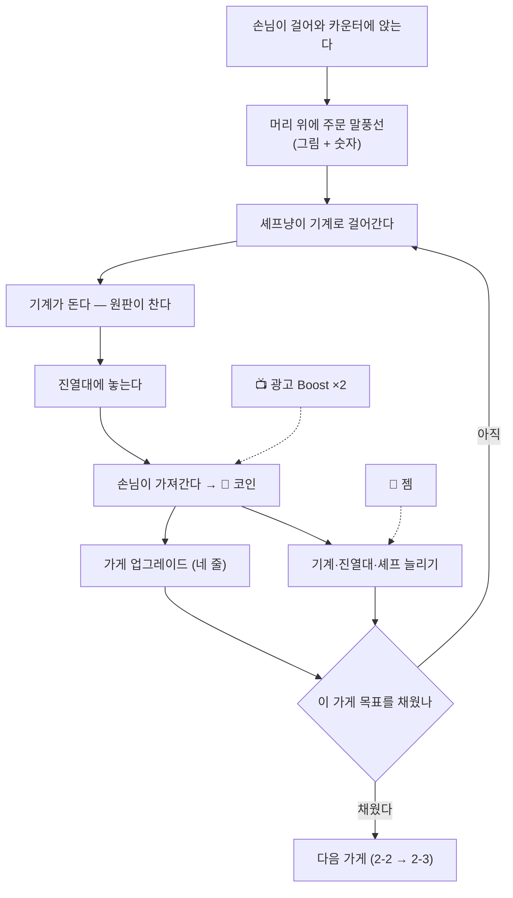

# 다른 게임에서 본 것

> **이 문서는 베끼기 목록이 아니다.** 남이 어떻게 풀었는지를 적어 두고,
> 우리 자(STORY.md의 *"이게 손님이 돌아오는 걸 느끼게 하나?"*)로 다시 재는 곳이다.
> **"저 게임이 하니까 우리도"는 이 문서에서 금지한다.**

---

# 고양이 스낵바 (Cat Snack Bar) — 2026-08-29에 뜯어봄

유저가 폰에서 4장을 찍어 보냈다. 유저 말: **"이렇게 바꿀 생각은 없지만 저걸
보길 바랬어."** 그러니 결론부터 — **구조는 안 가져온다. 손질은 가져온다.**

## 1. 화면에 무엇이 있나

세로 한 화면을 다섯 덩이로 쓴다.

```
┌─────────────────────────────────────┐
│ 🐾 784a   💎 2053 [+]   🎮  ☰       │ ← ① 맨 위 띠
│ [500% ▓▓▓▓▓░░] ⓘ                    │
├─────────────────────────────────────┤
│                          ┌────────┐ │
│                          │ 10H20M │ │ ← ③ 오른쪽 세로
│      길 · 나무 · 건물     │ 🍬 2   │ │
│      (손님이 걸어오는 곳)  ├────────┤ │
│                          │ 🍔 2   │ │
│                          └────────┘ │
│  ┌──┐ ┌──┐ ┌──┐ ┌──┐ ┌──┐          │ ← 주문 말풍선
│  │🍪1│ │🥐2│ │🍪1│ │🥐1│ │🥤1│      │   (그림 + 숫자, 글자 없음)
│  └──┘ └──┘ └──┘ └──┘ └──┘          │
│  🐱  🐱  🐱  🐱  🐱  🐱             │ ← 손님이 카운터 뒤에 앉아 줄
│ ═══════════════════════════════════ │ ← 카운터
│  [기계]      🐱‍🍳  ◔   🐱‍🍳          │ ← 주방: 셰프냥 + 진행 원판
│  [기계]   🐱‍🍳    ◑    🐱‍🍳          │
│  [기계]                             │
│  [🥤][🥐][ ][ ][🧁][▨][▨]           │ ← 진열대: 물건마다 한 칸,
├─────────────────────────────────────┤    빈 칸·잠긴 칸이 보인다
│ 💡                            ┌───┐ │ ← ④ 왼쪽 세로 / 스테이지
│ 👜                            │2-2│ │
│ ▓▓▓▓░░░░░░░░░░░░░░░░░░░░░░░░░░░░░░ │ ← 스테이지 진행 막대
├─────────────────────────────────────┤
│  🏪    🔴   [📺 Boost×2 +5m]  👕  ⬆️ │ ← ⑤ 맨 아래 고정 다섯 칸
└─────────────────────────────────────┘
```

| | 자리 | 무엇이 |
|---|---|---|
| ① | 맨 위 띠 | **돈 두 가지뿐**(🐾 코인 · 💎 젬). 젬 옆에 [+] 하나로 결제. 아래 `500%` 배율 막대 + ⓘ |
| ② | 가운데 전부 | **게임 세계.** 창(UI)이 하나도 안 떠 있다 |
| ③ | 오른쪽 세로 | 기간제 손님 `10H 20M` · 특별 주문 둘(🍬2 · 🍔2) |
| ④ | 왼쪽 세로 | 💡 힌트 · 👜 가방. **그 밖엔 없다** |
| ⑤ | 맨 아래 | 상점 · 빨간 단추 · **광고 부스트(제일 큰 자리)** · 옷 · 승급 |

## 2. 눈에 띈 것 다섯

**① 글자가 거의 없다.** 주문은 **그림 + 숫자**뿐이다. 화면 전체에서 글자가
있는 곳은 맨 위 숫자와 업그레이드 모달뿐이다.

**② 한 화면 = 한 가게.** 우하단 `2-2`가 지금 몇 장 몇 번째 가게인지 말한다.
가게를 다 키우면 다음 가게로 넘어간다 — **스테이지 게임**이다.

**③ 가게는 빈 터에서 시작해 하나씩 채운다.** 두 번째 사진의 샌드위치 가게는
탁자 하나 · 셰프 하나 · 진열대 하나뿐이고 나머지는 **텅 빈 잔디**다.
세 번째 사진은 탁자 둘 · 셰프 둘 · 기계 넷. 첫 사진은 셰프 다섯 · 진열대 일곱.

> ★ **이게 우리가 2026-08-29에 만든 작업대 단(段)과 똑같다.** 마당 크기는
> 고정이고 그 위를 하나씩 사서 채운다. 우리가 고른 길이 흔한 정답이라는 확인이다.

**④ 업그레이드가 네 줄뿐이다.** 「스낵바 관리」 창을 열면 이게 전부다:

| 이름 | 하는 일 | 값 |
|---|---|---|
| 대용량 우유 데우기 | 초코 라떼 **만드는 시간 ↓** | 73a |
| 진한 초콜릿향 | 초코 라떼 **값 ×3** | 170a |
| 반죽 대량 숙성 | 미니 도넛 **만드는 시간 ↓** | 860a |
| 주문이 산더미야 | **셰프냥 이동속도 ↑** | 1.2b |

물건 하나에 손잡이 둘(시간 · 값) + 가게 전체에 하나(이동속도).
**이름이 전부 그 가게의 말로 되어 있다** — "생산속도 +10%"가 아니라
"대용량 우유 데우기"다.

**⑤ 셰프 이동속도를 돈 받고 판다.** 그들도 **걸어가는 시간이 병목**이라는 걸
안다. 우리도 같다(`CRAFT.walk` 1.4초) — 우리는 그걸 패시브 스킬 '너구리 걸음'
한 자리에만 숨겨 뒀다.

## 3. 한 판의 흐름



## 4. 우리와 같은 것 · 다른 것

| | 고양이 스낵바 | 너구리 만물상 |
|---|---|---|
| 주문 | 손님 머리 위, **그림 + 숫자** | 같다 |
| 만들기 | 일꾼 하나가 기계 하나 | 같다 (손 하나가 작업대 하나) |
| 이동 | 걸어간다. **속도를 판다** | 걸어간다(1.4초). 스킬에 한 칸 숨어 있다 |
| 자리 채우기 | 빈 가게를 하나씩 산다 | 같다 (작업대 단) |
| **무대** | **한 화면 = 한 가게, 스테이지제** | **마을 하나, 가게 스무 채가 동시에 돈다** |
| **강화 수** | **네 줄** | 물건 레벨 8 + 나뭇잎 강화 13 + 승급 + 일꾼 |
| 글자 | 거의 없다 | **가게 창이 글자투성이다** |
| 광고 | 맨 아래 한가운데, 제일 큰 단추 | 자리를 아직 안 정했다 |
| 지금 어디쯤 | `2-2` + 진행 막대가 늘 보인다 | 없다 |

## 5. 그래서 무엇을 할까

**안 가져온다 — 스테이지제.**
우리 축은 *"무너진 산골 장터에, 짐승 손님들이 하나씩 돌아온다"*다.
가게를 하나 키우고 **버리고** 다음으로 가면 마을이 되살아나는 그림이 안 된다.
스낵바는 *가게를 옮겨 다니는* 게임이고 우리는 *한 마을을 되살리는* 게임이다.
이건 우열이 아니라 다른 게임이다.

**가져온다 — 셋.**

| | 무엇 | 왜 |
|---|---|---|
| ⭐⭐⭐ | **강화 이름을 그 가게의 말로.** "생산 속도 +10%" → "풀무를 크게 갈았다" | 스낵바의 네 줄이 다 이렇게 되어 있고, 그래서 읽힌다. **우리 나뭇잎 강화 13개를 줄일 때 같이 할 일이다** |
| ⭐⭐⭐ | **가게 창에서 글자 걷어내기** | 우리 '제품' 갈피는 한 줄에 이름·레벨·값·초·경고가 다 있다. 스낵바는 같은 정보를 **그림 + 숫자 + 원판**으로 낸다 |
| ⭐⭐ | **"지금 어디쯤"을 늘 보이게** | 스낵바는 `2-2` + 막대. 우리 식으로는 **가게 N/20 · 구역 이름**이 그 자리다. 지금은 창을 열어야만 보인다 |

**볼 만하지만 아직 아닌 것.**

- **일꾼 이동속도를 파는 것** — 우리도 걷는 값이 병목이라 손잡이로 쓸 수 있다.
  다만 **재 보기 전엔 안 넣는다**(운 번호 다섯). 이 프로젝트에서 "이러면
  나아질 것이다"는 여러 번 틀렸다.
- **광고 부스트를 맨 아래 한가운데** — 자리로는 맞지만, 우리 결(동화·힐링)에
  큰 노란 단추가 늘 떠 있는 게 맞는지는 따로 정할 일이다.
