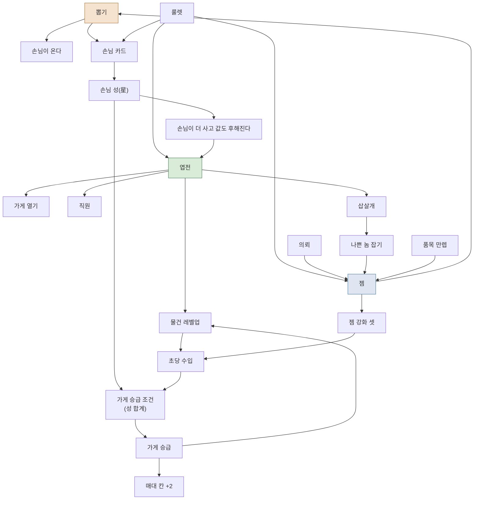
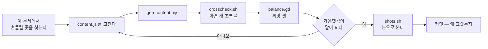

# 기능 지도 — 무엇이 무엇에 기대는가

**이 문서가 답하는 질문:** *"이걸 고치면 어디가 흔들리나?"*

`PLAN.md`가 **언제 무엇을 왜 했나**의 일지라면, 이 문서는 **지금 무엇이
무엇과 이어져 있나**의 지도다. 새 기능을 넣기 전이나 숫자를 만지기 전에
여기서 "이걸 건드리면 뭐가 같이 움직이나"를 먼저 본다.

> **왜 이런 문서가 필요한가.** 이 프로젝트에서 두 번 크게 당했다.
> 손님 오는 규칙을 바꿨더니 **재는 도구**와 **승급 문턱**이 같이 무너졌는데,
> 둘 다 고장 난 곳이 없어서 며칠을 헤맬 뻔했다. 코드는 시키는 대로 돌았고
> 끊어진 것은 **규칙과 규칙 사이**였다. 그 사이는 코드에 안 적혀 있다.

---

## 한눈에 — 무엇이 무엇을 먹여 살리나

**고리가 둘이다.**

- **엽전 고리** — 손님이 산다 → 엽전 → 레벨업 → 더 판다. 이게 본편이다
- **젬 고리** — 의뢰·나쁜 놈·만렙 → 젬 → 뽑기 → 손님 → 다시 엽전 고리로

**젬 고리가 막히면 엽전 고리도 멈춘다.** 손님이 뽑기로만 오기 때문이다.
2026-08-22에 이걸로 8시간 매출이 천 배 날아갔다.

---

## 기능 하나씩 — 어디에 기대고, 고치면 무엇이 흔들리나

### 물건 값과 레벨업

| | |
|---|---|
| 규칙이 사는 곳 | `content.js: LEVEL` · `sim.gd: price() · level_cost()` |
| 무엇에 기대나 | 가게 등급(값 ×4/×16) · 25레벨마다 값 ×2 · 젬 강화 '흥정 솜씨' |
| **고치면 흔들리는 것** | **거의 전부.** 초당 수입이 바뀌면 승급 조건(ips)·가게 값·의뢰 보상이 전부 따라 움직인다 |
| 재는 법 | `BAL_HOURS=8 BAL_SEED=1 …/balance.gd` — 씨앗 셋으로 가운뎃값 |

### 가게 승급

| | |
|---|---|
| 규칙이 사는 곳 | `content.js: RANKS` · `sim.gd: promote_reqs() · promote()` |
| 무엇에 기대나 | **손님 성 합계** · 초당 수입 · 다음 가게가 열려 있는지 · 매대를 전부 만렙까지 |
| **고치면 흔들리는 것** | 승급하면 **레벨이 1로 돌아간다**(벌이가 46%로 떨어졌다 9레벨에 본전). 매대 +2칸이 열리고 값이 ×4가 된다 |
| ⚠️ 조심 | **성이 오르는 방식을 바꾸면 `guests` 문턱도 같이 바꿔야 한다.** 실제로 이걸 놓쳐 가게가 다섯에서 멈췄다 |

### 손님

| | |
|---|---|
| 규칙이 사는 곳 | `content.js: GUESTS`(30종) · `sim.gd: _buy() · _gap()` |
| 무엇에 기대나 | **뽑기**(등장) · 성(사는 양·값) · 재고가 있는지 · 참을성 |
| **고치면 흔들리는 것** | 손님 하나가 늘면 초당 수입이 그만큼 는다. `every`·`qty`·`pay`는 곧바로 곡선이다 |
| ⚠️ 조심 | `speed`·`wild`는 **화면 전용**처럼 보이지만 `wild`는 sim이 쓴다(오는 간격을 흔든다) |

### 뽑기

| | |
|---|---|
| 규칙이 사는 곳 | `content.js: GACHA` · `sim.gd: pull() · gacha_lv()` |
| 무엇에 기대나 | **젬** · 누적 뽑기 횟수(단계) |
| **고치면 흔들리는 것** | 손님 등장 속도 → 초당 수입 → 게임 전체의 속도. **이 게임에서 제일 파급이 큰 숫자다** |
| 재는 법 | `tests/gacha.gd` (확률 십만 번) + `balance.gd`(뽑기 횟수·손님 수를 찍는다) |
| ⚠️ 조심 | 확률표는 **게임 안에서 그대로 보여준다.** 표만 고치고 코드를 안 고치면 거짓말이 된다 — `gacha.gd`가 그걸 잡는다 |

### 룰렛

| | |
|---|---|
| 규칙이 사는 곳 | `content.js: ROULETTE` · `sim.gd: spin() · roul_refill()` |
| 무엇에 기대나 | **실제 시간**(하루가 지나면 채워진다 — `wall`) |
| **고치면 흔들리는 것** | 젬 수입의 큰 몫이 여기서 나온다 → 뽑기 → 손님 |
| ⚠️ 조심 | 엽전 상은 **초당 수입의 몇 초치**다. 고정 금액으로 바꾸면 초반엔 후하고 후반엔 먼지가 된다 |

### 젬

| | |
|---|---|
| 나오는 곳 | 의뢰 · 나쁜 놈 잡기(10%) · 품목 만렙 · **룰렛** |
| 쓰는 곳 | **뽑기** · 젬 강화 셋 · 삯꾼 부르기 |
| **고치면 흔들리는 것** | 젬은 이제 **뽑기의 재화**다. 여기가 마르면 손님이 안 늘고 게임이 멈춘다 |
| 재는 법 | `balance.gd`가 '뽑기 N회 · 남은 젬' 을 찍는다. 뽑기 횟수가 안 늘면 젬이 마른 것이다 |

### 직원 · 삽살개

| | |
|---|---|
| 직원 | 가게마다 **한 명**. 둘째부터는 아무 효과가 없다(재서 확인). 진열대 +10칸, 계산 중 생산이 안 멈춘다 |
| 삽살개 | 가게 넷마다 한 마리. 무는 확률에 **상한 90%** — 안 걸면 나쁜 놈이 사라져 손가락이 할 일이 없어진다 |
| ⚠️ 조심 | 둘 다 "돈으로 사는 편의"다. **사는 사람이 손해 보면 안 된다**(네 번째 규칙) |

### 의뢰 · 기간제 이벤트

| | |
|---|---|
| 규칙이 사는 곳 | `content.js: QUEST · EVENTS` · `sim.gd: _quest_gain() · event_*()` |
| 무엇에 기대나 | 손님 성(보상 젬 수) · 물건 값(보상 엽전) · **실제 시간**(이벤트 마감) |
| 지금 상태 | 의뢰는 **저절로 걸린다.** 촌장이 가져오고 고르는 방식으로 바꾸기로 정했다(`FLOW.md` §8) |

### 저장

| | |
|---|---|
| 규칙이 사는 곳 | `sim.gd: SAVE_KEYS · SAVE_VER · load_from()` |
| **고치면 흔들리는 것** | **이미 놀고 있는 사람의 저장본.** 칸을 더하면 `SAVE_VER`를 올리고 옛 판을 받아주는 코드를 남긴다 |
| ⚠️ 조심 | 옛 판을 옮기는 코드에 **반드시 판 번호 조건**을 건다. 안 걸면 새 저장본에도 돌아서 값이 제멋대로 바뀐다(실제로 그랬다) |
| 재는 법 | `crosscheck.sh`의 `save`·`file`·`bits` — 저장했다 켠 판과 안 껐던 판을 끝까지 댄다 |

### 화면 (`godot/view/`)

| | |
|---|---|
| 규칙 | **sim을 읽기만 한다.** 경제 계산이 한 줄도 없다 |
| 주사위 | 화면은 **제 주사위**를 쓴다(`Village._grng`, `ShopPanel._rng`). sim의 주사위를 굴리면 대조가 그 자리에서 깨진다 |
| ⚠️ 조심 | 화면이 sim보다 **늦다.** 팔린 것은 즉시지만 손님은 걸어온다 — 그 시차를 잊으면 "손님이 오기도 전에 점장이 움직인다" 같은 것이 생긴다(실제로 두 번) |

### 그림 · 소리

| | |
|---|---|
| 그림 | `Art.tex()` — **있으면 쓰고 없으면 도형.** 어디서 멈춰도 게임이 돈다 |
| 소리 | `Sfx.play()` — 자리만 있고 파일이 없다. **돈 소리는 일부러 없다**(초당 수십 번이면 소음이다) |
| ⚠️ 조심 | 그림은 `godot/art/` 안에만. 밖에 두면 목록에서는 사라지는데 화면에는 안 나온다 |

---

## 숫자 하나를 만질 때의 순서

**씨앗 하나로 판단하지 않는다.** 이 게임은 씨앗만 바꿔도 8시간 매출이
1.06T~1.54T로 흔들린다. 재려는 효과보다 판마다의 운이 더 클 때가 있다.

---

## 게임 회사는 이걸 어떻게 관리하나 (참고)

우리가 하는 것과 회사가 하는 것을 나란히 둔 표다. **이름만 다르지 같은 것**이다.

| 회사에서 부르는 이름 | 하는 일 | 우리 것 |
|---|---|---|
| 기획서(Design Doc) | 기능 하나의 목적·규칙·예외 | `PLAN.md`의 그날 기록 |
| 시스템 다이어그램 | 무엇이 무엇에 기대나 | **이 문서** · `FLOW.md` |
| 데이터 시트 | 밸런스 숫자를 코드 밖에 모아 둔 표 | `content.js` |
| 이슈 트래커(Jira 등) | 할 일·정한 일·안 정한 일 | `FLOW.md`의 '아직 안 정한 것' |
| 회귀 시험(QA) | 고친 뒤에 다른 데가 안 깨졌나 | `tools/crosscheck.sh` (아홉) |
| 밸런스 시뮬레이터 | 사람 없이 며칠치를 돌려 본다 | `tests/balance.gd` |
| 화면 대조(Visual QA) | 화면이 이상해지지 않았나 | `tools/shots.sh` |
| 릴리즈 노트 | 이번 판에서 뭐가 바뀌었나 | 커밋 메시지 |
| 용어집 | 같은 것을 같은 말로 부른다 | `NAMES.md` |

**큰 회사도 제일 못 하는 것이 '영향 범위'다.** 사람이 적은 문서는 반드시
낡는다 — 이 프로젝트에서도 두 번 겪었다(삽살개 설명이 코드보다 좁았고,
직원 등급 주석은 코드에 없는 계획이었다).

그래서 **제일 믿을 만한 영향 문서는 글이 아니라 자동 측정**이다.
숫자를 고치면 `balance.gd`가 무엇이 움직였는지 말해 주고, 규칙을 고치면
`crosscheck.sh`가 어제와 뭐가 달라졌는지 말해 준다. **글은 그 이유를 적는 데
쓰고, 사실 확인은 도구에게 맡긴다.**
