# 너구리 만물상 — Visual Image Archive

파일명만 기록하지 않고 **실제 이미지를 나란히 보며** 생성 이력과 승인 상태를 확인하는 갤러리다.

> 브라우저에서 실제 이미지와 필수 170장 + 선택 110장 카드를 함께 보려면
> [image-archive.html](./image-archive.html)을 연다. 이 문서는 판단 근거와 텍스트 기록을 보존한다.

## 상태 언어

| 상태 | 뜻 |
|---|---|
| `없음` | 제작·검수할 PNG가 아직 없다 |
| `초안` | 이미지가 있거나 게임에 연결됐지만 규격·화면 검수·사용자 승인을 모두 통과하지 않았다 |
| `확정` | 최신 규격을 지키고 실제 Godot 화면 검수와 명시적 사용자 승인을 마쳤다 |

**파일 존재와 Godot 연결은 상태의 근거일 뿐, 그 자체가 `확정`은 아니다.**

## 현재 기준 — Godot 전환 감사

- 확인 날짜: `2026-08-22`
- 게임 기준 브랜치: `origin/claude/read-this-yyycmm`
- 확인 커밋: `5dacb82`
- 화면 기준: Godot `430×932`, 아이소메트릭 격자 `96×48`, 줌 `0.45~1.80`
- 필수 이미지: 자동 목록 기준 `170장`
- 선택 이미지: 성장 카드 `90장` + 가게별 점장 `20장`
- 필수 상태: `확정 0장 / 초안 170장 / 없음 0장`
- 전체 관리 대상: `280장` (`초안 210장 / 없음 70장`)

### 중요한 현재 상태

최신 브랜치에는 가게 10채, 30종 손님, 카드 뽑기, 룰렛과 움직임 계약이 추가됐다. 기존 점장
`make/sell`과 토끼는 실제 Godot 화면에 표시되지만 새 제작 규격의 절반 크기인 구규격이다.
직원 8장, 점장 걷기·수면·촌장 4장, 손님 29장, 뽑기·룰렛 3장, 손님 카드 1단 30장, 상호작용 3장, 물건 80장과 좌판 10장은 새 규격으로 생성했다. 필수 백일흔 장 모두
실제 화면 검수와 사용자 승인을 마치지 않았으므로 `초안`으로 분류한다.

| 구분 | 상태 | 최신 Godot 처리 |
|---|---|---|
| 점장·촌장 | 초안 6장 | make/sell은 구규격, 걷기·수면·촌장은 새 규격 |
| 직원 | 초안 8장 | 머리띠·초립·패랭이·백립의 작업·수면이 모두 연결·화면 검수 대기 |
| 손님 | 토끼와 새 규격 29종 초안 | 필드용 30종이 모두 채워짐 |
| 손님 카드 | 1단 초안 30장 + 2단 초안 20장 + 선택 없음 70장 | 20종은 수선된 마을 안쪽의 익숙한 단골로 성장 |
| 물건 | 초안 80장 | 열 가게 각 8종이 모두 채워짐 |
| 나쁜 놈 | 초안 3장 | 쥐·까마귀·삽살개 필드 그림 초안 |
| 좌판 | 초안 10장 | 열 가게가 모두 공통 골격의 전용 좌판을 사용 |
| 뽑기·룰렛 | 초안 3장 | 카드 뒷면·12칸 원판·바늘 초안 |
| 선택 전용 점장 | 초안 20장, 없음 0장 | 가게 10곳의 make/sell 두 포즈가 모두 들어옴. 걷기·수면은 공용 점장 그림 재사용 |

---

## 승인된 세계관 기준 이미지

<table>
  <tr>
    <td align="center">
      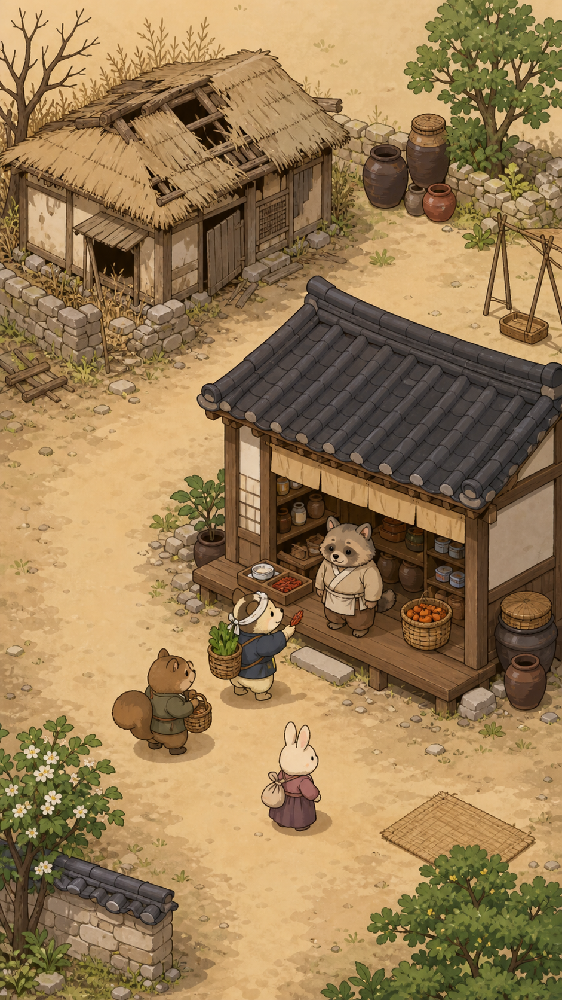
    </td>
  </tr>
  <tr>
    <td><strong>BP-V0.1-P01 · Approved</strong> 따뜻한 조선 서민 마을, 폐허와 복구의 대비, 한국 생활소품과 재료감의 기준. 현재 Godot 격자 배치를 확정하는 화면 설계도는 아니다.</td>
  </tr>
</table>

---

## 점장 너구리 디자인 변천

### 제작 포즈 · make

<table>
  <tr>
    <th>V0.1 · 전신 서민복</th>
    <th>V0.2 · 무복식</th>
    <th>V0.3 · 짧은 앞치마</th>
  </tr>
  <tr>
    <td align="center">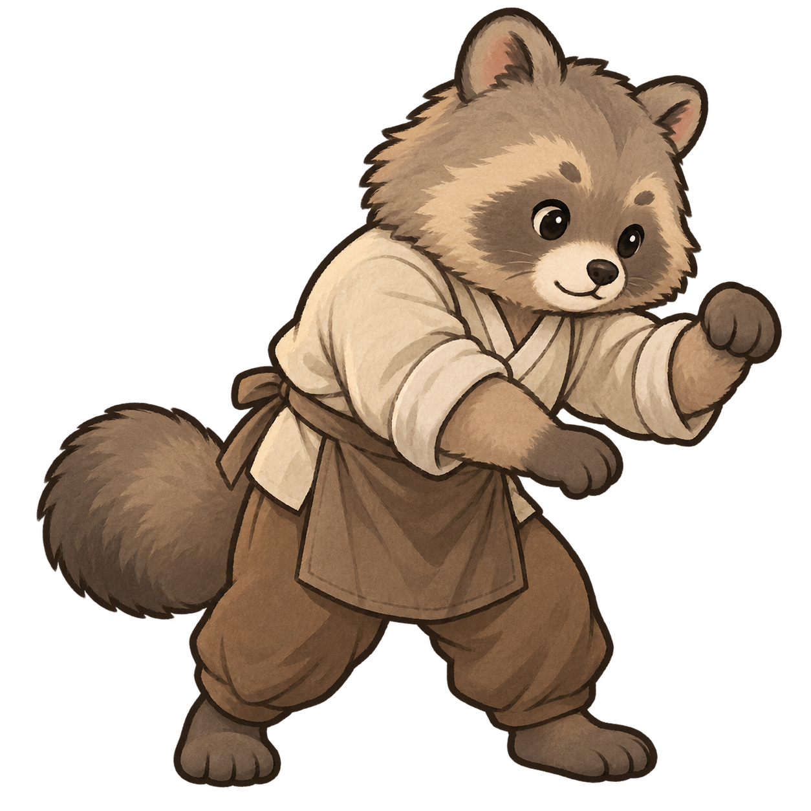</td>
    <td align="center"></td>
    <td align="center"></td>
  </tr>
  <tr>
    <td><strong>Revision</strong> 작은 캐릭터에 전신 복식이 과함.</td>
    <td><strong>Revision</strong> 실루엣은 좋아졌지만 점장 표식이 부족함.</td>
    <td><strong>Current candidate</strong> 털 실루엣을 살리고 앞치마만 남김.</td>
  </tr>
</table>

### 판매 포즈 · sell

<table>
  <tr>
    <th>V0.1 · 전신 서민복</th>
    <th>V0.2 · 무복식</th>
    <th>V0.3 · 짧은 앞치마</th>
  </tr>
  <tr>
    <td align="center"></td>
    <td align="center">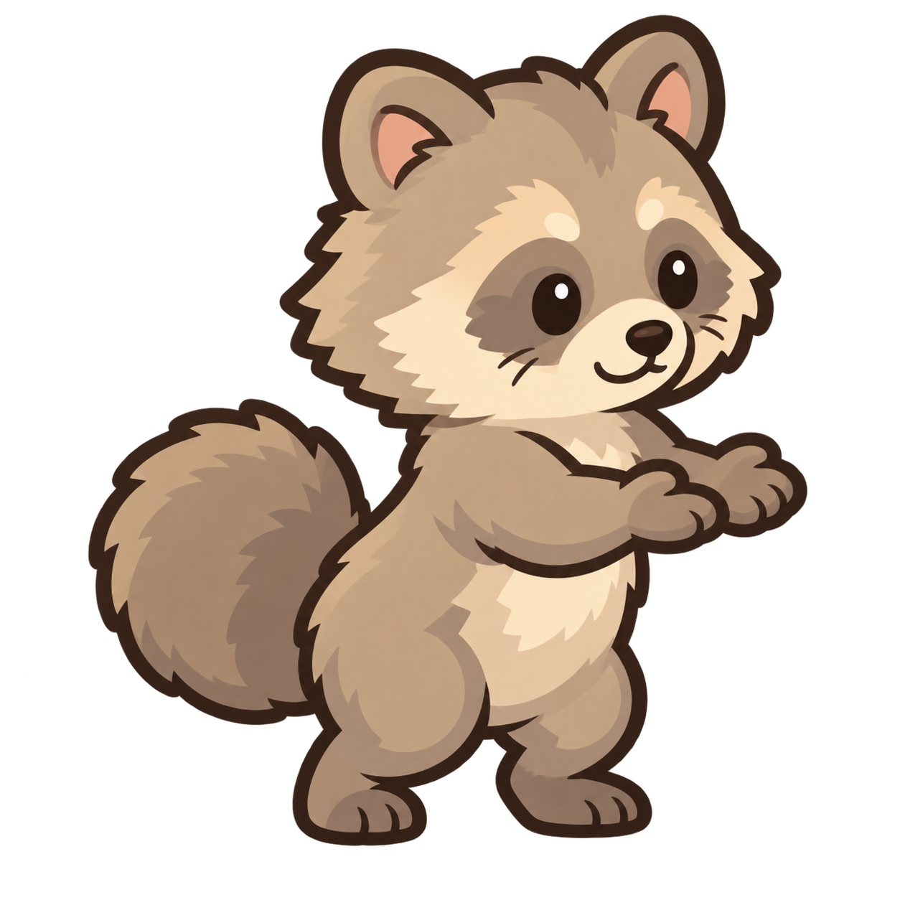</td>
    <td align="center"></td>
  </tr>
  <tr>
    <td><strong>Revision</strong> 복식 세부가 플레이 크기에서 사라짐.</td>
    <td><strong>Revision</strong> 역할 표식 추가 필요.</td>
    <td><strong>Current candidate</strong> 몸 밖으로 내민 앞발과 앞치마가 읽힘.</td>
  </tr>
</table>

---

## 실제 게임용 초안 파일

아래 투명 PNG 세 장은 최신 Godot 화면에 연결됐다. 다만 현재 파일은 예전 1배 규격이고
새 주문 규격은 2배 원본이므로 `확정`이 아니라 `초안`이다.

<table>
  <tr>
    <th>제작 · 초안 72×72</th>
    <th>판매 · 초안 72×72</th>
    <th>토끼 · 초안 64×64</th>
  </tr>
  <tr>
    <td align="center"></td>
    <td align="center"></td>
    <td align="center">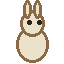</td>
  </tr>
  <tr>
    <td><code>godot/art/hero/raccoon-make.png</code> 목표 144×144</td>
    <td><code>godot/art/hero/raccoon-sell.png</code> 목표 144×144</td>
    <td><code>godot/art/guests/rabbit.png</code> 목표 128×128</td>
  </tr>
</table>

### 직원 4등급 · 작업/수면 초안

<table>
  <tr>
    <th>머리띠 · 작업/수면</th>
    <th>초립 · 작업/수면</th>
  </tr>
  <tr>
    <td align="center"></td>
    <td align="center"></td>
  </tr>
  <tr>
    <td><code>band-work.png</code> · <code>band-sleep.png</code> <strong>Draft</strong> · 차렷 자세와 몽글 수면</td>
    <td><code>chorip-work.png</code> · <code>chorip-sleep.png</code> <strong>Draft</strong> · 누런 풀 갓</td>
  </tr>
  <tr>
    <th>패랭이 · 작업/수면</th>
    <th>백립 · 작업/수면</th>
  </tr>
  <tr>
    <td align="center"></td>
    <td align="center"></td>
  </tr>
  <tr>
    <td><code>paeraengi-work.png</code> · <code>paeraengi-sleep.png</code> <strong>Draft</strong> · 넓은 대나무 갓</td>
    <td><code>baengnip-work.png</code> · <code>baengnip-sleep.png</code> <strong>Draft</strong> · 흰 갓</td>
  </tr>
</table>

### 필드 상호작용·룰렛·첫 물건 초안

<table>
  <tr>
    <td align="center">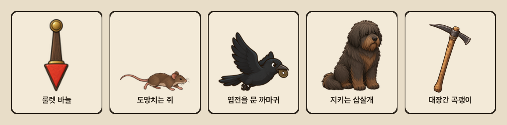</td>
  </tr>
  <tr>
    <td><strong>Generated · LOG-UI-002 / LOG-PEST-001 / LOG-ITEM-001</strong> 각 그림은 한 장만 만들고, 회전·이동·들썩임·반응은 Godot 코드가 맡는다. 곡괭이는 남은 물건 79종의 첫 규격 기준이다.</td>
  </tr>
</table>

### 대장간 도구 5종 초안

<table>
  <tr>
    <td align="center">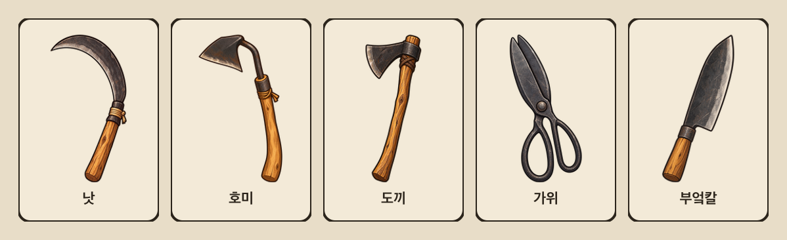</td>
  </tr>
  <tr>
    <td><strong>Generated · LOG-ITEM-002</strong> 곡괭이와 같은 숯빛 무쇠·황토갈색 나무·짙은 외곽선으로 묶었다. 다섯 장 모두 독립 PNG라 카드와 판매 손 오버레이에 재사용한다.</td>
  </tr>
</table>

### 대장간 마무리·필방 시작 5종 초안

<table>
  <tr>
    <td align="center">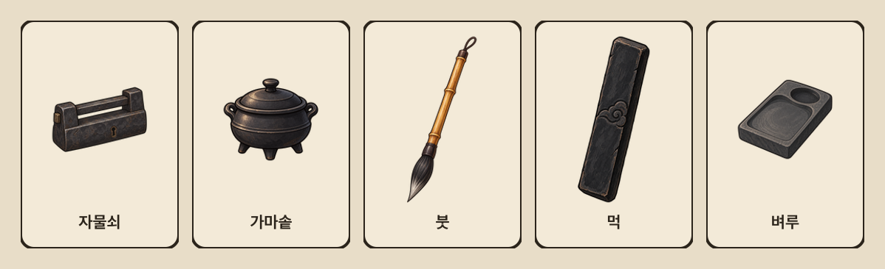</td>
  </tr>
  <tr>
    <td><strong>Generated · LOG-ITEM-003</strong> 대장간 8종을 모두 채우고 필방의 대나무·먹·돌 재료 기준을 시작했다. 가로 물건도 `128×224` 투명 캔버스 중앙에 놓는다.</td>
  </tr>
</table>

### 필방 나머지 5종 초안

<table>
  <tr>
    <td align="center">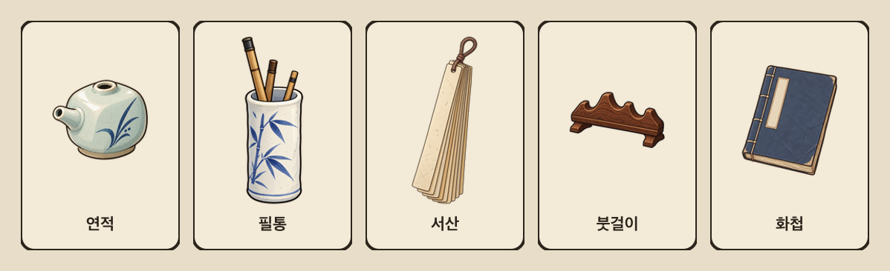</td>
  </tr>
  <tr>
    <td><strong>Generated · LOG-ITEM-004</strong> 박물관 자료로 서산의 용도와 종이 재질을 확인해 독서 횟수를 세는 한지 표식 묶음으로 단순화했다. 이로써 필방 8종도 모두 찼다.</td>
  </tr>
</table>

### 지물포 종이 5종 초안

<table>
  <tr>
    <td align="center">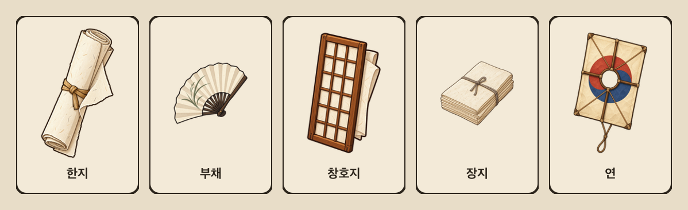</td>
  </tr>
  <tr>
    <td><strong>Generated · LOG-ITEM-005</strong> 같은 한지빛을 유지하면서 말림·반원·창살·두께·바람구멍으로 용도를 갈랐다. 장지는 내부 ID와 달리 바닥재가 아닌 두꺼운 문서지다.</td>
  </tr>
</table>

### 지물포 마무리·옹기점 시작 5종 초안

<table>
  <tr>
    <td align="center">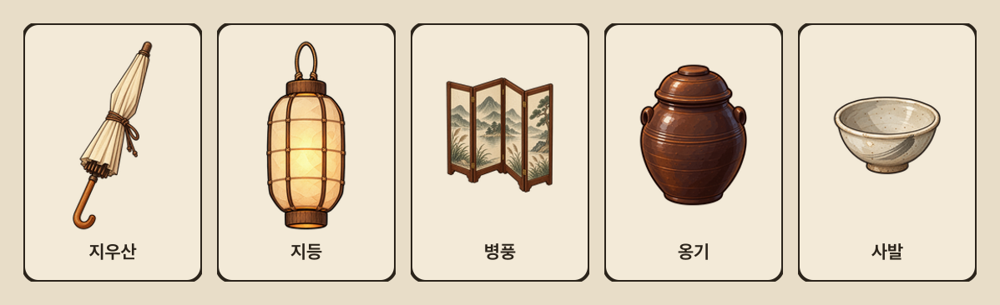</td>
  </tr>
  <tr>
    <td><strong>Generated · LOG-ITEM-006</strong> 미색 한지와 소박한 골조로 지물포를 마무리했다. 옹기점은 갈색 저장 옹기와 밝은 생활 사발의 용도 대비로 시작한다.</td>
  </tr>
</table>

### 옹기점 그릇 5종 초안

<table>
  <tr>
    <td align="center">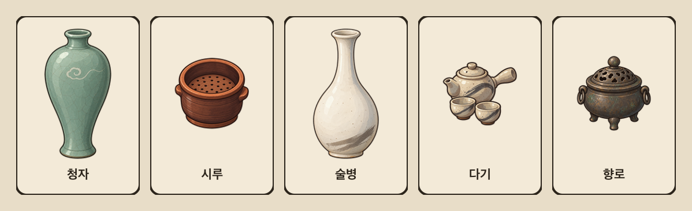</td>
  </tr>
  <tr>
    <td><strong>Generated · LOG-ITEM-007</strong> 비취 유약·갈색 흙·백자·분청·노쇠 금속을 나누고, 구멍·컵·뚜껑으로 쓰임새를 가른다. 향로의 연기는 별도 그림으로 만들지 않는다.</td>
  </tr>
</table>

### 옹기점 마무리·약재상 시작 5종 초안

<table>
  <tr>
    <td align="center">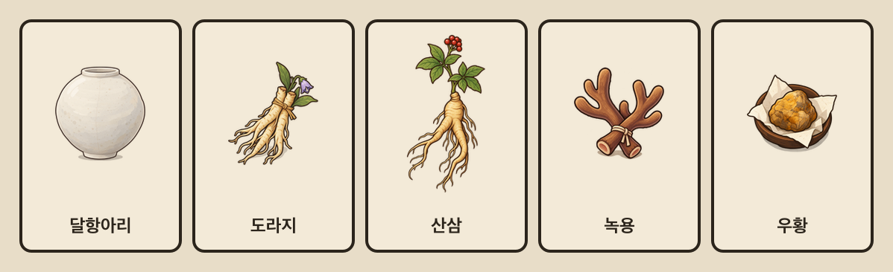</td>
  </tr>
  <tr>
    <td><strong>Generated · LOG-ITEM-008</strong> 넓은 무장식 달항아리로 옹기점을 마무리하고, 꽃·열매·절단면·약포를 작은 식별 표식으로 써 약재상 네 재료를 구분한다.</td>
  </tr>
</table>

### 약재상 마무리·국밥집 시작 5종 초안

<table>
  <tr>
    <td align="center">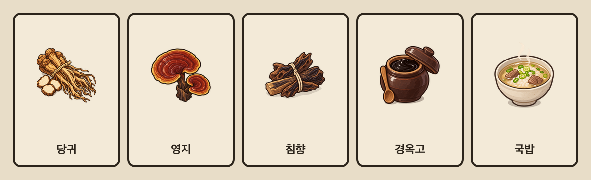</td>
  </tr>
  <tr>
    <td><strong>Generated · LOG-ITEM-009</strong> 절편·층진 갓·검은 수지결·열린 약단지로 약재상을 마무리하고, 밥알과 짧은 김을 남긴 맑은 국밥으로 음식 품목을 시작한다.</td>
  </tr>
</table>

### 국밥집 국물 5종 초안

<table>
  <tr>
    <td align="center">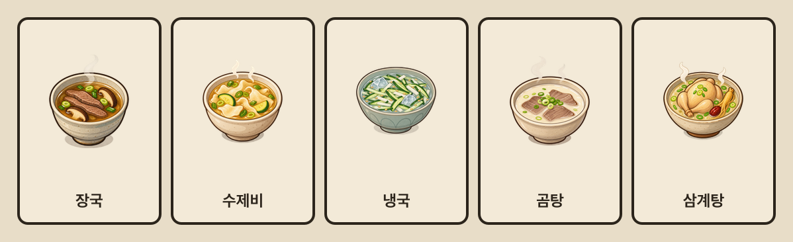</td>
  </tr>
  <tr>
    <td><strong>Generated · LOG-ITEM-010</strong> 간장빛·수제비 반죽·오이채·뽀얀 국물·통닭을 중심 표식으로 써 같은 사발 계열 안에서도 다섯 국물을 가른다.</td>
  </tr>
</table>

### 국밥집 마무리·주막 시작 5종 초안

<table>
  <tr>
    <td align="center">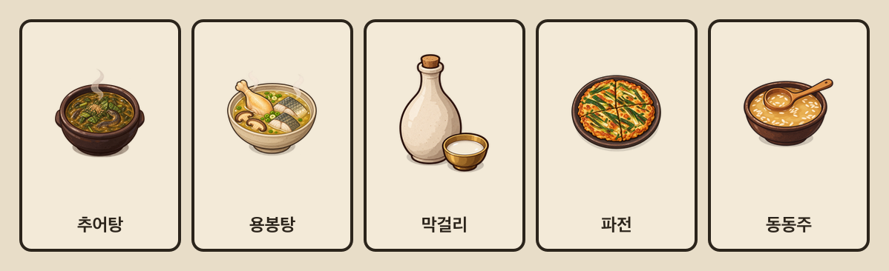</td>
  </tr>
  <tr>
    <td><strong>Generated · LOG-ITEM-011</strong> 추어탕은 짙은 들깨탕, 용봉탕은 닭과 잉어 조합으로 국밥집을 마무리했다. 주막은 병·둥근 전·쌀알 뜬 사발로 첫 세 품목을 가른다.</td>
  </tr>
</table>

### 주막 나머지 5종 초안

<table>
  <tr>
    <td align="center">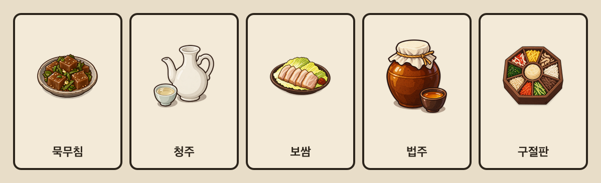</td>
  </tr>
  <tr>
    <td><strong>Generated · LOG-ITEM-012</strong> 묵 정육면체·미색 주전자·배추 위 편육·천 덮개 술항아리·팔각 아홉 칸으로 주막 나머지를 서로 다른 구조로 마무리했다.</td>
  </tr>
</table>

### 꼬치집 첫 5종 초안

<table>
  <tr>
    <td align="center">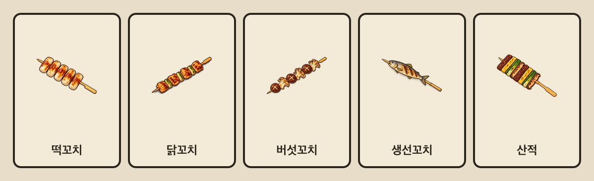</td>
  </tr>
  <tr>
    <td><strong>Generated · LOG-ITEM-013</strong> 같은 대각선 대나무 막대 안에서 원통·네모/파·버섯 갓·통생선·직사각 줄무늬의 반복 단위로 다섯 꼬치를 구분한다.</td>
  </tr>
</table>

### 꼬치집 마무리·떡집 시작 5종 초안

<table>
  <tr>
    <td align="center">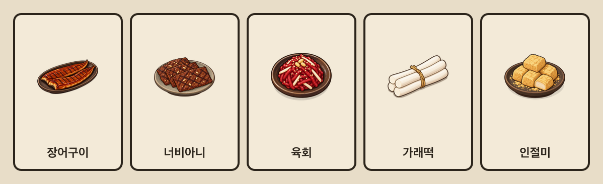</td>
  </tr>
  <tr>
    <td><strong>Generated · LOG-ITEM-014</strong> 긴 장어·넓은 격자 고기·붉은 채로 꼬치집을 마무리하고, 흰 원통 묶음과 콩고물 네모로 떡집을 시작한다.</td>
  </tr>
</table>

### 떡집 형태 대비 5종 초안

<table>
  <tr>
    <td align="center">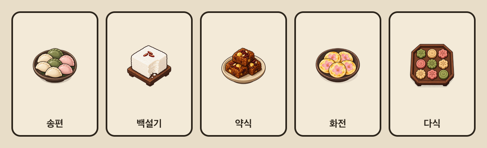</td>
  </tr>
  <tr>
    <td><strong>Generated · LOG-ITEM-015</strong> 반달·큰 흰 네모·짙은 찰밥 사각·꽃을 얹은 납작한 원·찍음 과자 3×3 배열로 떡집 다섯 품목을 구분한다.</td>
  </tr>
</table>

### 떡집 마무리·푸줏간 시작 5종 초안

<table>
  <tr>
    <td align="center">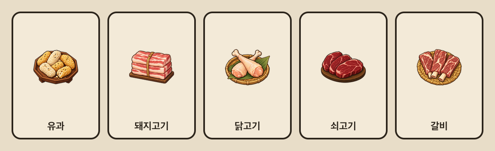</td>
  </tr>
  <tr>
    <td><strong>Generated · LOG-ITEM-016</strong> 밝은 튀김 결로 떡집을 닫고, 지방층·닭다리·둥근 살코기·돌출 뼈를 써 푸줏간 첫 네 품목을 비그래픽하게 구분한다.</td>
  </tr>
</table>

### 푸줏간 마무리·첫 대장간 좌판 초안

<table>
  <tr>
    <td align="center">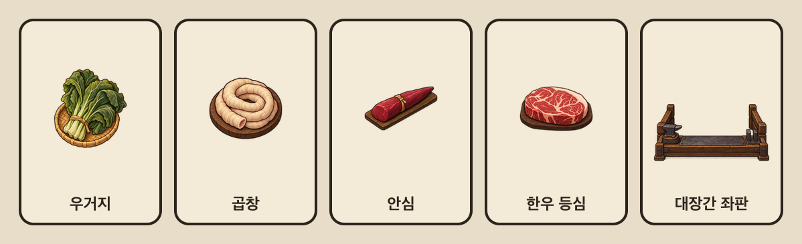</td>
  </tr>
  <tr>
    <td><strong>Generated · LOG-ITEM-017 / LOG-STALL-001</strong> 잎 묶음·미색 고리·길쭉한 필렛·굵은 마블링으로 물건 80종을 닫고, 낮은 모루와 무쇠판을 둔 첫 좌판을 시작한다.</td>
  </tr>
</table>

### 대장간 좌판 위 물건 합성 시험

<table>
  <tr>
    <td align="center">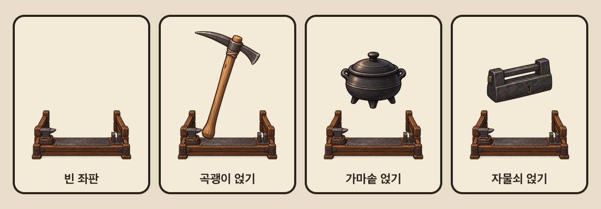</td>
  </tr>
  <tr>
    <td><strong>Hypothesis · Claude 요청 메모 12</strong> 좌판 중앙은 비었지만 현재 `_stall()`은 물건의 전체 투명 캔버스를 기준으로 놓아 가로형 물건이 상판에서 뜬다. 품목별 그림을 다시 미는 대신 실제 알파 경계 아랫변을 공통 상판선에 맞추는 코드 정렬이 필요하다.</td>
  </tr>
</table>

### 필방부터 국밥집까지 좌판 5종 초안

<table>
  <tr>
    <td align="center">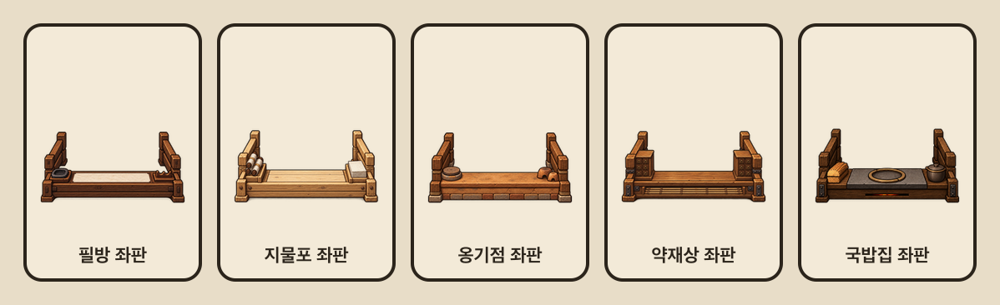</td>
  </tr>
  <tr>
    <td><strong>Generated · LOG-STALL-002</strong> 같은 낮은 U자 골격 안에서 한지 작업면·종이 옆선반·흙 기단·양쪽 약장·검은 온장판으로 다섯 업종을 구분한다.</td>
  </tr>
</table>

### 좌판 5종 대표 물건 합성 시험

<table>
  <tr>
    <td align="center">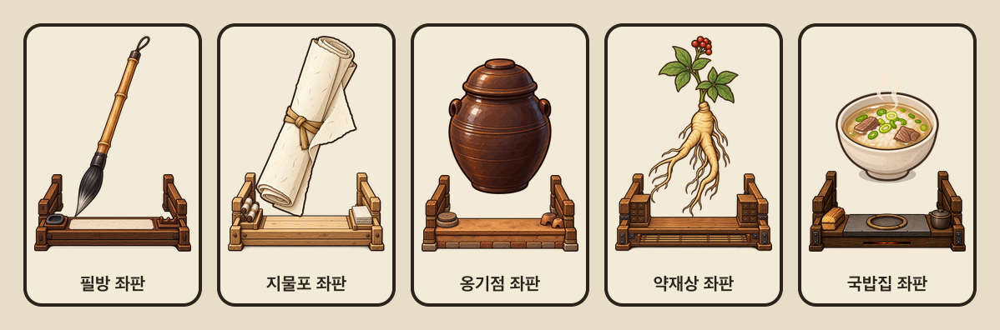</td>
  </tr>
  <tr>
    <td><strong>Hypothesis</strong> 대표 물건을 겹쳐도 양옆 고정 설비와 바닥 재료가 남아 업종을 보조한다. 물건의 실제 알파 경계 바닥 정렬은 클로드 요청 메모 12에서 공통으로 처리한다.</td>
  </tr>
</table>

### 주막부터 푸줏간까지 좌판 4종 초안

<table>
  <tr>
    <td align="center">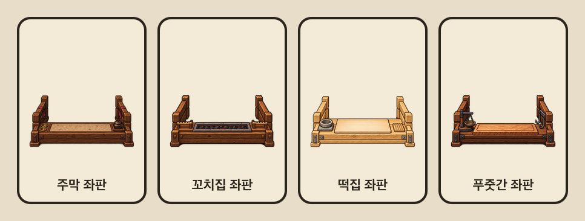</td>
  </tr>
  <tr>
    <td><strong>Generated · LOG-STALL-003</strong> 멍석 술상·돌 숯홈·밝은 떡판·두꺼운 도마로 마지막 네 업종을 구분하고 필수 좌판 열 종을 채웠다.</td>
  </tr>
</table>

### 마지막 좌판 4종 대표 물건 합성 시험

<table>
  <tr>
    <td align="center">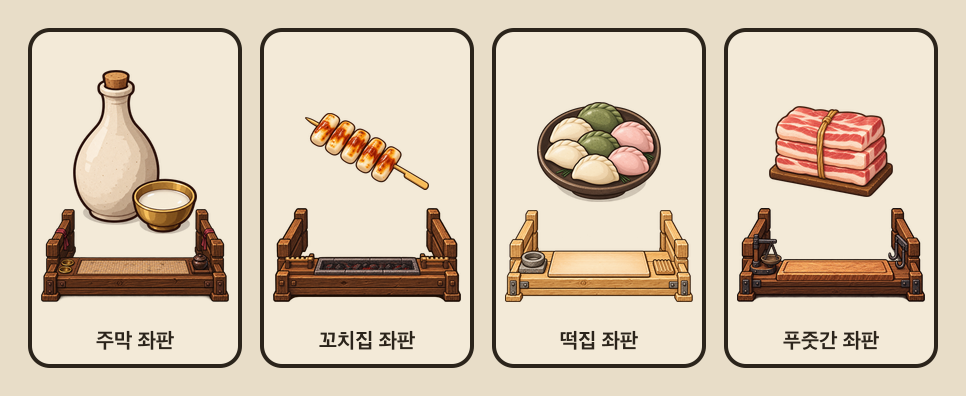</td>
  </tr>
  <tr>
    <td><strong>Hypothesis</strong> 대표 상품이 좌판 중앙을 덮어도 술잔받침·꼬치받침·돌절구·저울과 갈고리가 양옆에 남아 업종을 보조한다.</td>
  </tr>
</table>

### 열 가게 좌판 전체 초안

<table>
  <tr>
    <td align="center">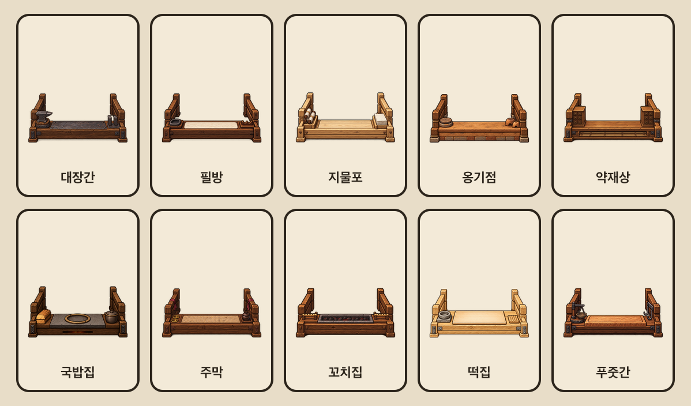</td>
  </tr>
  <tr>
    <td><strong>Required 10/10 · Generated</strong> 모든 좌판이 같은 폭·높이·하단 접점·빈 중앙을 공유하고, 양옆 고정 설비와 작업면 재료만 바뀐다. 실제 Godot 화면 검수와 사용자 승인 전까지 전부 초안이다.</td>
  </tr>
</table>

### 가게별 점장 첫 5장 초안

<table>
  <tr>
    <td align="center">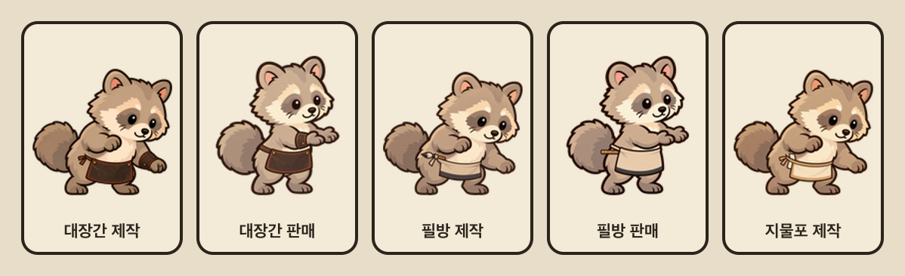</td>
  </tr>
  <tr>
    <td><strong>Generated · LOG-CLERK-001</strong> 공용 점주의 얼굴·몸·짧은 앞치마·두 포즈를 유지하고, 짙은 가죽·먹색 밑단·밝은 한지색의 큰 색면과 작은 옆 표식만 바꾼다.</td>
  </tr>
</table>

### 가게별 점장 두 번째 5장 초안

<table>
  <tr>
    <td align="center">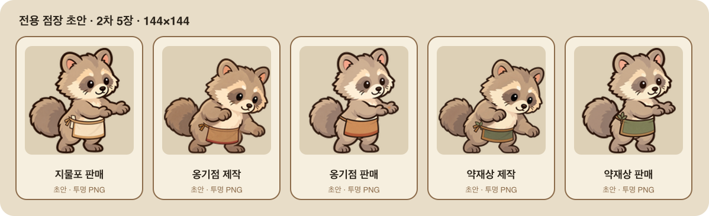</td>
  </tr>
  <tr>
    <td><strong>Generated · LOG-CLERK-002</strong> 지물포를 한지색으로 닫고 옹기점은 황토색, 약재상은 쑥빛 앞치마로 구분했다. 생성 원본의 체크무늬는 보존하고 게임용에는 가장자리 연결 배경만 제거했다.</td>
  </tr>
</table>

### 가게별 점장 세 번째 5장 초안

<table>
  <tr>
    <td align="center">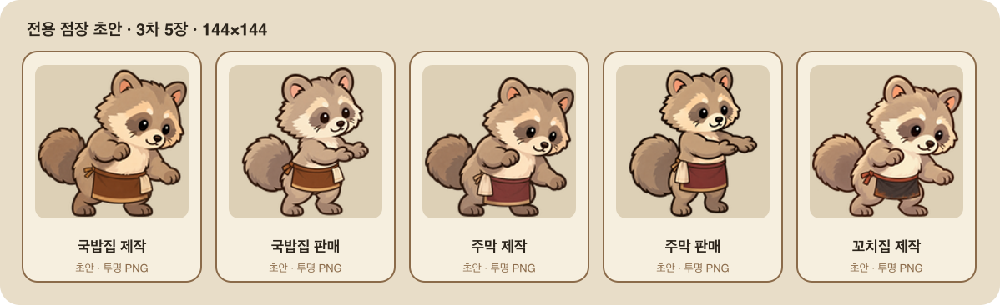</td>
  </tr>
  <tr>
    <td><strong>Generated · LOG-CLERK-003</strong> 밤색 수건 앞치마, 자주색 흰 천 앞치마, 먹색 그을음 앞치마로 음식점 세 업종을 구분하되 음식과 도구는 캐릭터에 고정하지 않았다.</td>
  </tr>
</table>

### 가게별 점장 마지막 5장 초안

<table>
  <tr>
    <td align="center">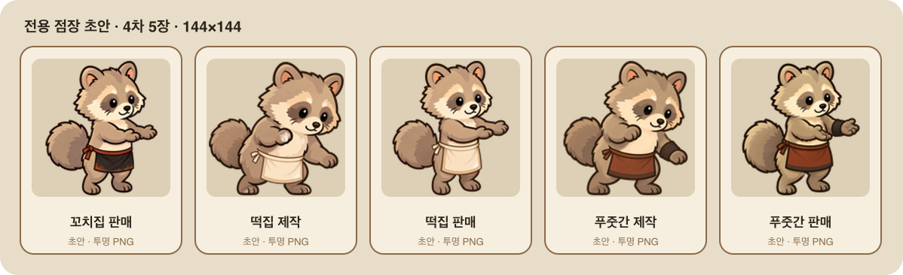</td>
  </tr>
  <tr>
    <td><strong>Generated · LOG-CLERK-004 · Optional 20/20</strong> 먹색·아이보리·적갈색 가죽 앞치마로 마지막 세 업종을 닫았다. 직접 상품과 날붙이는 넣지 않고 빈손 합성 구조를 유지한다.</td>
  </tr>
</table>

### 손님 성장 카드 2단 첫 5장 초안

<table>
  <tr>
    <td align="center">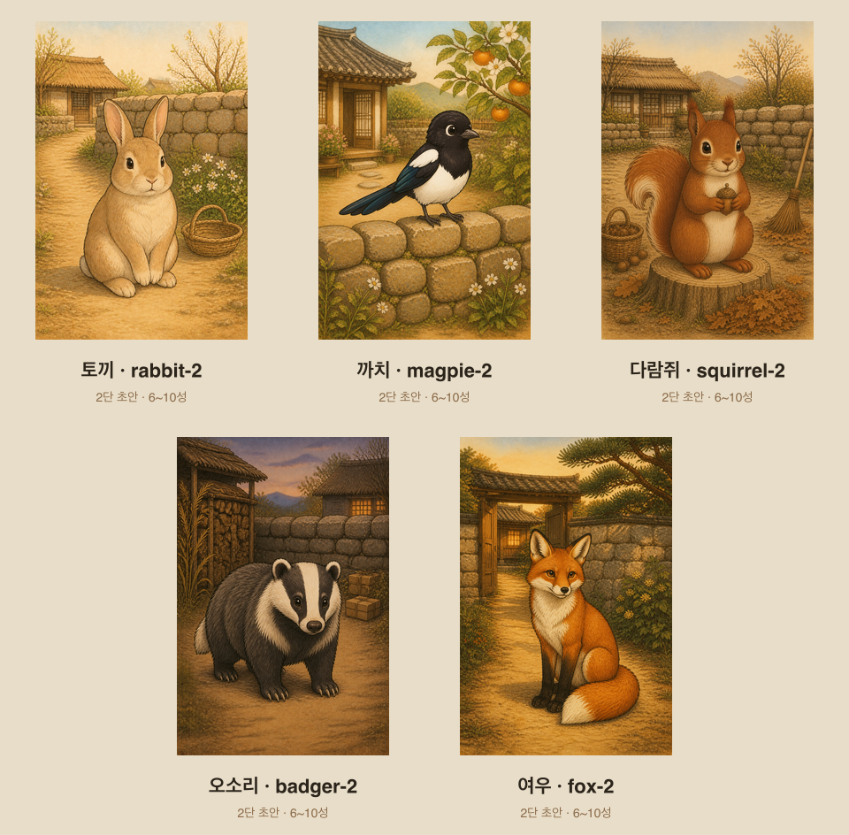</td>
  </tr>
  <tr>
    <td><strong>Generated · LOG-CARD-007</strong> 같은 동물의 정체성과 자연 자세를 유지하고, 수선된 돌담·쓸린 길·정돈된 생활소품으로 6~10성의 ‘익숙한 단골’ 단계를 시험했다.</td>
  </tr>
</table>

### 손님 성장 카드 2단 두 번째 5장 초안

<table>
  <tr>
    <td align="center">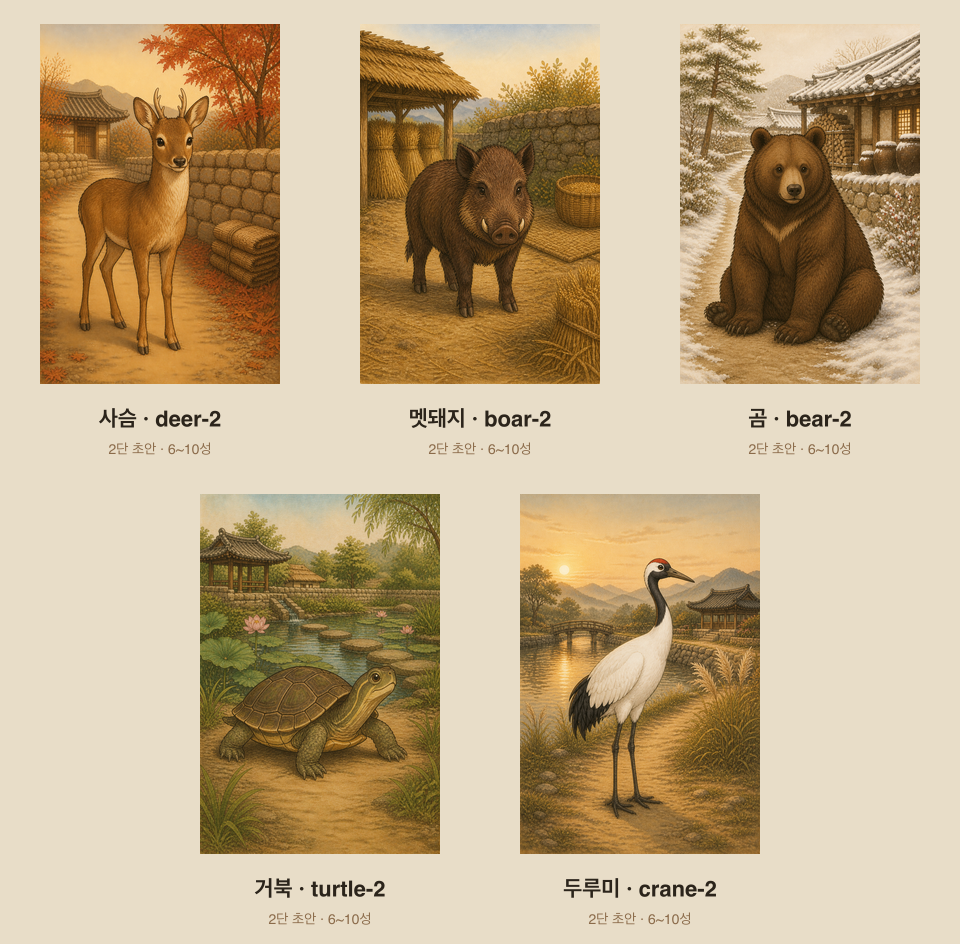</td>
  </tr>
  <tr>
    <td><strong>Generated · LOG-CARD-008</strong> 각 1단의 계절과 자세를 유지하고, 추수마당·눈길·연못·물길의 수선 정도만 높여 2단 규칙을 등급 전반에 확장했다.</td>
  </tr>
</table>

### 손님 성장 카드 2단 세 번째 5장 초안

<table>
  <tr><td align="center">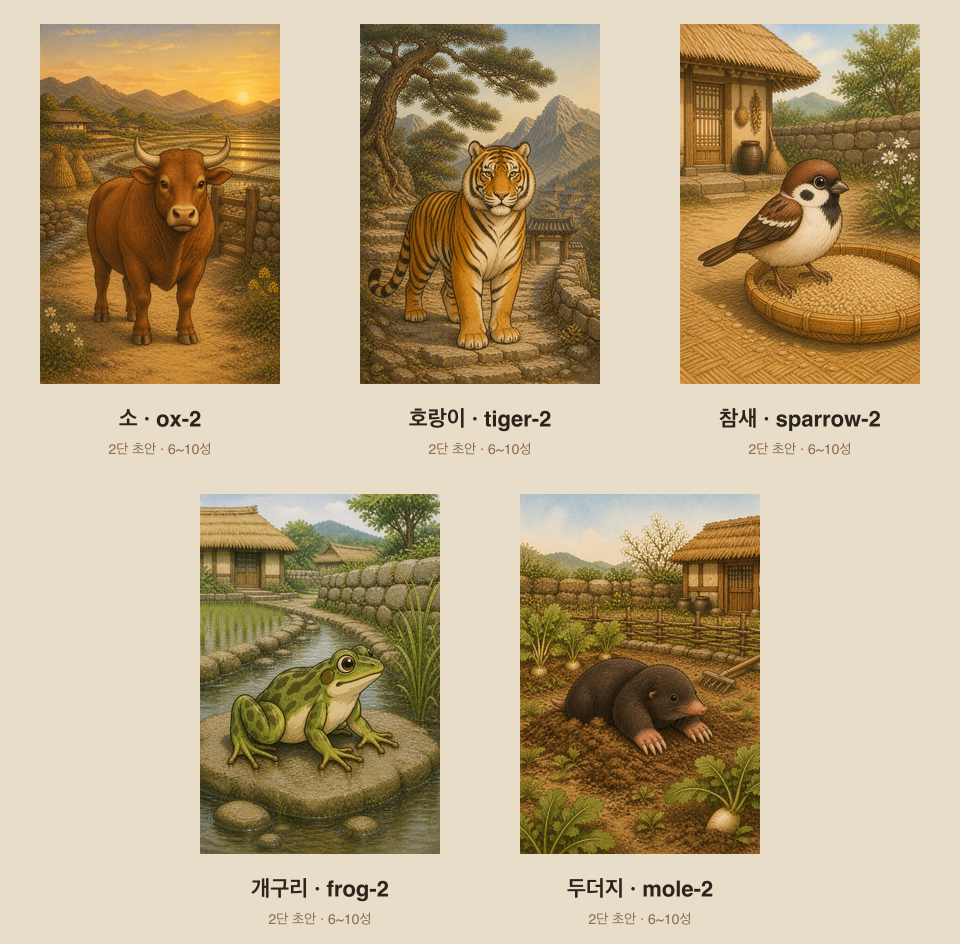</td></tr>
  <tr><td><strong>Generated · LOG-CARD-009</strong> 소·호랑이는 풍경 규모, 흔한 세 종은 생활 공간 정돈만 올려 등급 양끝의 2단 차이를 유지했다.</td></tr>
</table>

### 손님 성장 카드 2단 네 번째 5장 초안

<table>
  <tr><td align="center">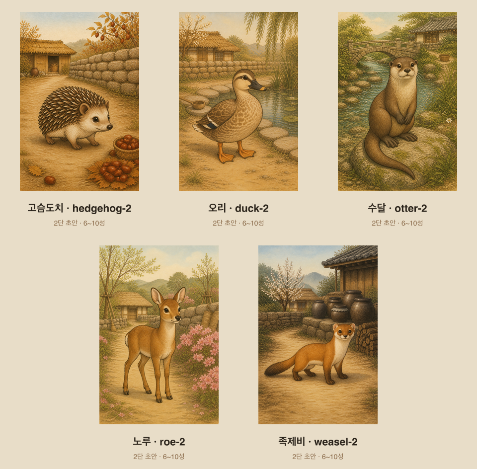</td></tr>
  <tr><td><strong>Generated · LOG-CARD-010</strong> 1단의 생활 장소를 유지하고 대추·물가·돌다리·어린나무·장독대의 정돈과 수선만 한 단계 올렸다.</td></tr>
</table>

### 초안 → 확정 게이트

1. 점장은 `144×144`, 토끼는 `128×128` 투명 PNG로 다시 출력한다.
2. 발끝이 이미지 아래 변에 닿고 불필요한 투명 여백이 없는지 확인한다.
3. 실제 표시 크기 `72×72`·`64×64`와 줌 `0.45`, `1.0`, `1.8`에서 번짐·접점·가림 순서를 본다.
4. 점장과 직원은 크기가 같고, 점장은 손의 연장·직원은 모자로 구분되는지 본다.
5. 사용자 승인 기록이 남은 뒤에만 `확정`으로 바꾼다.

---

## 이미지 주문 변경 — Godot 전환 후

최신 `ASSETS.md`, `MOTION.md`, `tools/art.mjs` 기준 필수 총수는 `170장`이다.
가게가 10채로 늘면서 물건이 80장, 좌판이 10장이 됐다.
성장 카드 90장과 가게별 점장 20장은 폴백이 있어 선택 작업으로 분리됐다.

| 분류 | 전체 | 확정 | 초안 | 없음 | 제작 규격 → 화면 표시 |
|---|---:|---:|---:|---:|---|
| 공용 점장·촌장 | 6 | 0 | 6 | 0 | 144×144 → 72×72 |
| 직원 | 8 | 0 | 8 | 0 | 144×144 → 72×72 |
| 물건 | 80 | 0 | 80 | 0 | 128×224 → 64×112 |
| 손님 필드 | 30 | 0 | 30 | 0 | 128×128 → 64×64 |
| 손님 카드 1단 | 30 | 0 | 30 | 0 | 512×768 → 카드 화면 |
| 쥐·까마귀·삽살개 | 3 | 0 | 3 | 0 | 128×128 → 64×64 |
| 가게별 좌판 | 10 | 0 | 10 | 0 | 192×176 → 96×88 |
| 카드 뒷면·룰렛 | 3 | 0 | 3 | 0 | 512×768 / 512×512 / 64×96 |
| **필수 합계** | **170** | **0** | **170** | **0** | |
| 손님 성장 카드 (선택) | 90 | 0 | 20 | 70 | 512×768 |
| 가게별 점장 (선택) | 20 | 0 | 20 | 0 | 144×144 → 72×72 |
| **전체 관리 대상** | **280** | **0** | **210** | **70** | |

제작 우선순위는 최신 주문서대로 `손님 필드 30 → 카드 1단 30 → 점장 → 직원 → 물건 80 → 좌판·나쁜 놈`이다.
손님 필드 30종, 손님 카드 1단 30종, 점장, 직원, 물건 80종, 좌판 10종, 상호작용 3종과 룰렛 UI는 모두 초안이다. 필수 170장과 선택 전용 점장 20장을 모두 채웠고 성장 카드 2단 20장을 시작했다. 남은 선택 작업은 성장 카드 70장이다.

---

## 과거 게임 화면 기록

<table>
  <tr>
    <td align="center">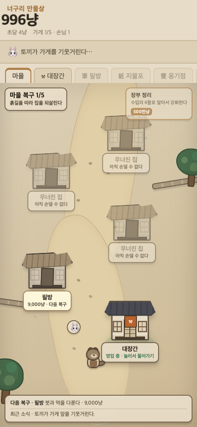</td>
  </tr>
  <tr>
    <td><strong>Legacy HTML/CSS QA</strong> Godot 전환 전의 세로 마을 화면 구조 시험. 현재 런타임 화면이나 카메라 기준으로 사용하지 않는다.</td>
  </tr>
</table>

최신 게임 브랜치에는 `godot/shot 2.png`가 한 장 보존돼 있다. 대표 화면이 안정되면
`docs/art/qa/godot-*.png`로 옮겨 날짜와 확인 커밋을 함께 남긴다.

---

## 아카이브 갱신 규칙

1. 마스터 원화와 게임용 축소 PNG를 둘 다 보존한다.
2. 반려된 버전도 삭제하지 않고 `Revision` 또는 `Rejected` 이유와 함께 둔다.
3. 게임 연결 여부는 별도 표식으로 남기고, 연결됐다는 이유만으로 `확정`하지 않는다.
4. `확정`은 최신 규격·Godot 화면 검수·사용자 승인을 모두 통과했을 때만 사용한다.
5. 생성물이 추가될 때마다 이 문서에 썸네일을 먼저 놓고 생성 로그 ID를 연결한다.
6. 파일명 목록만 있는 문서는 주문서이고, 이 문서는 실제 이미지를 보는 기록이다.
